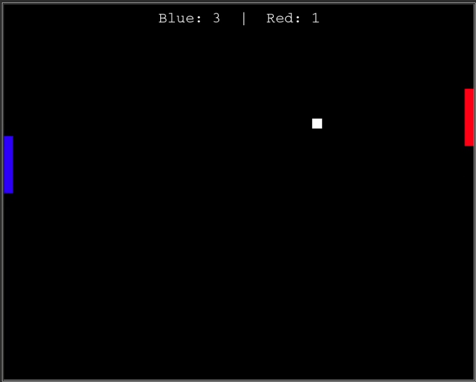
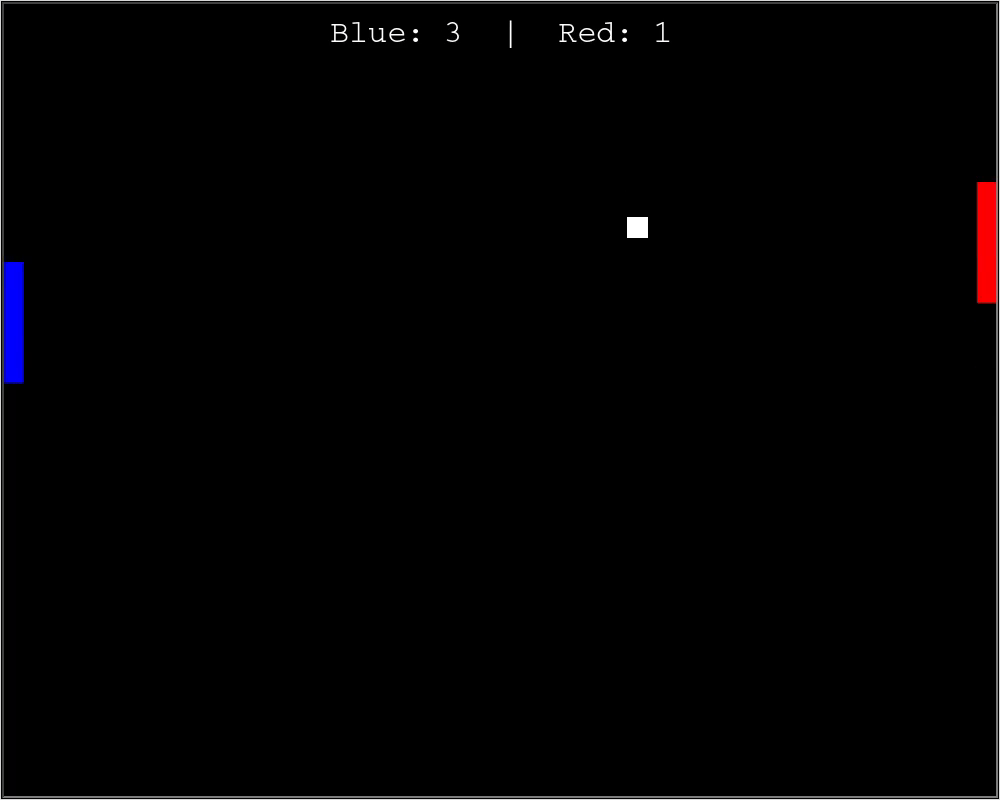

# Ping-Pong-Game

 
  
 

<!-- {{{Table of Contents --> 

## Table of Contents

* [Table of Contents](#table-of-contents)
* [Introduction](#introduction)
* [Technical Details](#technical-details)
* [Key User Features](#key-user-features)
* [Key Developer Features](#key-developer-features)
* [UML Diagram](#uml-diagram)
* [Project DEMO](#project-demo)

<!-- }}} -->

<!-- {{{Introduction --> 
 

## Introduction

This Project is a simple Ping-Pong Game written in python using OOP and the python-turtle library. 
 
<!-- }}} -->

<!-- {{{Technical Details --> 

## Technical Details

* Language : Python

* GUI : Python-turtle 

* Design Approach : Object Oriented Programming

* Control Mechanism : Event Driven Programming

 
<!-- }}} -->

<!-- {{{ Project Demo --> 

## Project Demo

 

<!-- }}} -->

